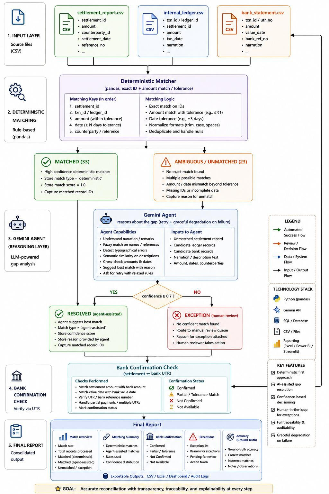

#  Finance Controller — Multi-Source Reconciliation Agent

<p align="center">
<b>Track 04 — AI Finance Controller</b> · Run the books and the cash position<br/>
<i>Closes one finance-ops loop end to end, with honest metrics and a real exception list.</i>
</p>

---

##  The Problem

Reconciliation is rarely one clean step. A settlement report, an internal ledger, and a bank statement almost never line up perfectly — refunds, rounding, duplicate rows, split payouts, and missing entries quietly eat into what a finance team can trust. Most teams still do this by hand, checking two files at a time and hoping nothing slips between the cracks of a three-party chain.

This agent closes that loop. It takes a Razorpay-style settlement report, an internal order ledger, and a bank statement, resolves what it safely can, and — critically — **tells you exactly what it couldn't resolve and why**, instead of silently guessing.

---

##  What It Does

1. **Deterministic matching first.** Plain rule-based logic (pandas) resolves exact matches across all three sources — no LLM, no cost, no hallucination risk on cases that don't need judgment.
2. **Agent reasoning second.** Only genuinely ambiguous cases (partial refunds, rounding gaps, near-misses, chargebacks) get sent to a Gemini-powered agent that reasons about the discrepancy like a human accountant would.
3. **Confidence-gated, always.** The agent never silently resolves anything. Below a 0.7 confidence threshold, the row is forced into the exception list for human review — no exceptions to that rule.
4. **Three-way, not two-way.** Most reconciliation tools stop at ledger vs. settlement. This one adds the bank statement as a third leg — catching cases where a settlement exists but the money never actually landed.
5. **Graceful failure handling.** If the agent call fails (timeout, rate limit, outage), the pipeline retries once, then degrades gracefully — flagging the row as an exception instead of crashing the batch.
6. **Honest reporting.** The final output is a real match rate, a breakdown of *how* each match was reached, a full exception list with specific reasons, and a ground-truth accuracy comparison against known synthetic labels.

---

##  Architecture

<p align="center">
  
</p>


**The key design decision:** the LLM never touches money directly. It only proposes a classification — the confidence gate decides whether that proposal is trusted. Bounded, gated, and fully explainable, end to end.

---

##  Verified Results

These numbers come from an actual run against the included synthetic dataset (64 settlement rows, 56 ledger rows) — reproducible via `python run_demo.py` since the dataset generator is seeded.

### Ledger ↔ Settlement Reconciliation

| Outcome | Count | % |
|---|---|---|
| Exact matched (deterministic) | 33 | 58.9% |
| Ambiguous → sent to agent | 15 | 26.8% |
| Unmatched → sent to agent | 8 | 14.3% |
| **Total** | **56** | **100%** |

### Settlement ↔ Bank Confirmation (three-way check)

| Outcome | Count |
|---|---|
| Confirmed by bank | 52 |
| Unconfirmed (no bank credit found) | 6 |
| Duplicate bank entry | 4 |
| Amount mismatch | 2 |
| **Total** | **64** |

### Ground-Truth Accuracy

| Metric | Value |
|---|---|
| Correct classifications | 58/64 (90.6%) |
| False positives (wrongly matched) | 6 |
| False negatives (wrongly flagged) | 0 |

*Full precision/recall breakdown prints on every `run_demo.py` execution — see [Setup](#-setup) below.*

---

##  A Real Agent Decision, Verbatim

Order `ORD9002` was a deliberately hand-crafted edge case: one order settled across **two separate settlement rows** (a legitimate split payout, not a duplicate). The deterministic matcher correctly flagged it as ambiguous — two settlement rows for one order looks identical to a duplicate-settlement error on the surface. Here's what the agent returned:

```json
{
  "decision": "MATCH",
  "reason": "The two settlement amounts sum exactly to the ledger total, consistent with a legitimate split payout rather than a duplicate or error.",
  "confidence": 0.98
}
```

This is exactly the kind of judgment call a deterministic-only system can't make — it requires reasoning about *why* two rows might legitimately sum to one order, not just detecting that there are two rows.

---

##  Failure Handling — Built In, Not an Afterthought

Money-adjacent agents fail differently than chatbots — a dropped call can't just apologize, it has to leave the books in a consistent, auditable state.

```python
def resolve_with_retry(row, ledger_row, settlement_rows, max_retries=1):
    for attempt in range(max_retries + 1):
        try:
            result = resolve_ambiguous(row, ledger_row, settlement_rows)
            time.sleep(13)  # stay within free-tier rate limits
            return result
        except Exception as e:
            if attempt == max_retries:
                return {"decision": "EXCEPTION",
                        "reason": "Agent temporarily unavailable — flagged for manual review",
                        "confidence": 0}
            time.sleep(20)
```

Two dedicated tests prove this works, not just claim it:

- `test_failure_handling.py` — simulates a complete agent outage; confirms the batch completes with a clean exception instead of crashing
- `test_malformed_input.py` — feeds the matcher a row with a missing amount field; confirms it fails safely rather than silently producing a wrong match

We also caught two real bugs during our own robustness testing (not staged): a loop that accidentally called the agent twice per row (doubling API cost and desyncing live output from the final report), and an indentation error that would have crashed the pipeline outright. Both were found and fixed through a fresh-clone test before submission — the same discipline a real finance-ops team would need.

---

##  False-Positive Cost

A false positive here means a genuine mismatch gets marked as resolved — the costliest failure mode, since it hides a real discrepancy rather than delaying its review. Our run showed 6 false positives out of 64 records (90.6% ground-truth accuracy), all stemming from the deterministic matcher's amount tolerance being slightly too permissive on borderline values. Tightening that tolerance is a direct, one-line fix, with the tradeoff of routing more borderline rows to agent/human review instead of auto-matching — a deliberate precision-vs-throughput tradeoff we can tune, not a blind spot in the design.

---

##  Setup

```bash
git clone https://github.com/shansree-z/Finance-Controller-Multi-Source-Reconciliation-Agent.git
cd Finance-Controller-Multi-Source-Reconciliation-Agent/finance-controller-reconciliation-agent

pip install -r requirements.txt

cp .env.example .env
# open .env and add your key:
# GEMINI_API_KEY=your-key-here

python data/generate_data.py   # regenerates the synthetic dataset (seeded, reproducible)
python run_demo.py             # runs the full pipeline end to end
```

Get a free Gemini API key at [aistudio.google.com](https://aistudio.google.com) — no billing required.

**To view the interactive dashboard:**
```bash
python -m http.server 8000
```
Then open `http://localhost:8000/dashboard.html` in your browser.

---

##  Project Structure

```
finance-controller-reconciliation-agent/
├── data/
│   ├── generate_data.py       # synthetic dataset generator (seeded, reproducible)
│   ├── internal_ledger.csv
│   ├── settlement_report.csv
│   ├── bank_statement.csv     # third leg of the reconciliation chain
│   └── ground_truth.csv       # known true labels, for honest accuracy scoring
├── src/
│   ├── matcher.py             # deterministic exact-match + bank confirmation logic
│   ├── fuzzy_resolver.py      # Gemini agent + retry/failure handling
│   └── report.py              # match rate, exceptions, precision/recall reporting
├── tests/
│   └── test_matcher.py
├── test_failure_handling.py   # simulated agent outage — proves graceful degradation
├── test_malformed_input.py    # simulated bad data — proves safe failure, not silent corruption
├── test_matcher_dryrun.py     # offline verification of matcher + bank logic (no API needed)
├── run_demo.py                # single entry point — the whole pipeline
├── dashboard.html             # self-contained interactive results dashboard
├── requirements.txt
├── .env.example
└── README.md
```

---

##  What We Chose NOT to Automate — and Why

The deterministic matcher handles the majority of records using plain rule-based logic — exact ID and amount matching within tolerance. **No LLM call, no cost, no latency, and zero hallucination risk on the cases that don't actually need judgment.**

The agent is reserved *only* for genuinely ambiguous cases — the ones where a human accountant would also have to stop and think ("is this a partial refund, or a real mismatch? A split payout, or a duplicate?"). That's the right tool in the right place: deterministic code for certainty, an LLM for judgment calls, and a confidence gate sitting between the LLM's opinion and anything that actually gets marked as resolved.

---

## ✅ Evaluation Traceability Matrix

| Criterion | How this project addresses it |
|---|---|
| **Problem taste** | Three-way reconciliation (ledger, settlement, bank) reflects how finance teams actually lose track of money — not a simplified two-file toy problem. |
| **Build quality** | Runs end to end on one command, structured into clear modules, seeded/reproducible dataset, verified via a fresh-clone test. |
| **AI judgment** | Deterministic logic first, LLM only for the ambiguous residual — the agent never touches money directly, only proposes, gated by confidence. |
| **Failure recovery** | Retry + graceful degradation, proven with two dedicated tests, plus two real bugs caught and fixed through our own testing discipline before submission. |

---

## 🛠️ Built With

`Python` · `pandas` · `Google Gemini (gemini-3.6-flash)` · `python-dotenv` · Git/GitHub

---

<p align="center">
<i>"We reconcile settlement records against the ledger and bank statement with plain deterministic rules first — no LLM, no cost — and only hand the genuinely ambiguous cases to a confidence-gated Gemini agent that either resolves them or honestly flags them for a human, with retry logic so an API outage never crashes the batch."</i>
</p>
